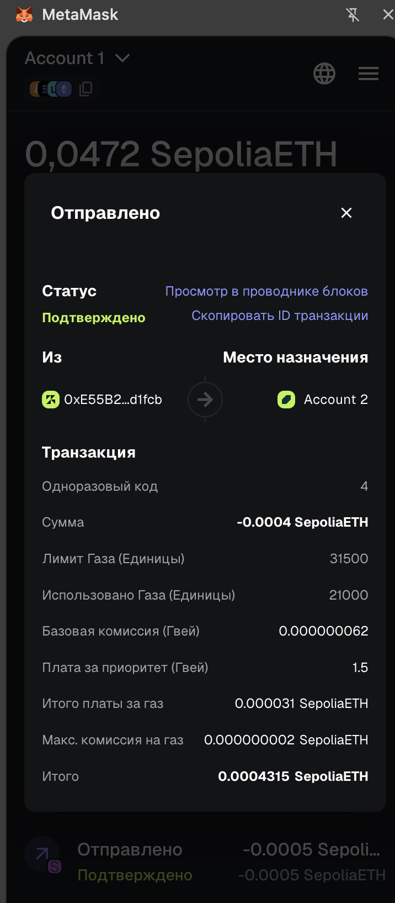
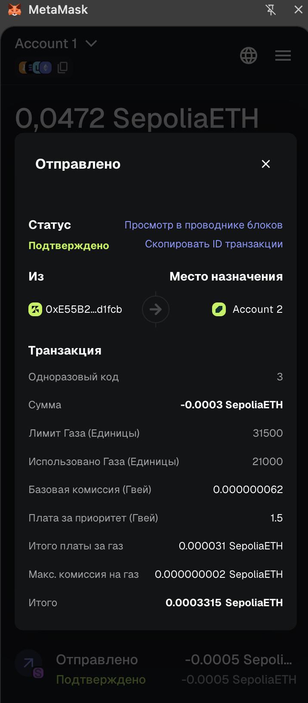

# Blockchain Assignment

## 1. Wallet
Metamask account address:  
`0xE55B2A96c64296092fcE5eF836085E96210d1fcb`

## 2. Chains
Incoming transaction link:  
https://sepolia.etherscan.io/tx/0xa33cb358afc0d8298c539ea2784c26e7e694ae5d5c588f8fa53daffccb8f67a9

## 3. Transactions
Transfer transaction link:  
https://sepolia.etherscan.io/tx/0x5fc835de965fa0142edb963adc0570fc92eaf27ddb3a866fc4a5c6440dece02e

Accounts were restored successfully after reinstalling MetaMask using the same Secret Recovery Phrase.

Restored Account 1:  
`0xE55B2A96c64296092fcE5eF836085E96210d1fcb`

Restored Account 2:  
`0x34c8517bf71203d4d3E7EBD074E01DE2B9ce2414`

## 4. Gas
I tested reduced gas fees on Sepolia. Even with reduced fees, the transaction was still confirmed, which is expected on a low-load testnet.

Reduced-fee transaction link:  
https://sepolia.etherscan.io/tx/0x38d65913e47d4a98a408b5750d370c48dbaddb8ebeed0c99cd1139a10d091d56

Transaction details:
- Status: Confirmed
- Nonce: 2
- Amount: 0.0005 SepoliaETH
- Gas limit: 31500
- Gas used: 21000
- Total gas fee: 0.000021 SepoliaETH

Mainnet gas tracker:  
https://etherscan.io/gastracker

Testnet explorer:  
https://sepolia.etherscan.io

## 5. Nonce
I sent one transaction with a manually increased nonce and then sent another transaction with the missing previous nonce. After the lower nonce transaction was confirmed, the higher nonce transaction was also confirmed.

Transaction 1 (nonce 4):  
https://sepolia.etherscan.io/tx/0xd5997da9a88ad558f564851f5afa918fa893e362a198c539e689f869c30ad899

Transaction 2 (nonce 3):  
https://sepolia.etherscan.io/tx/0x42db51ef504ec4b4ee8c7f05710118f9a0026b24a326450042bf001419e1b7d1

Transaction 1 details:
- Status: Confirmed
- Nonce: 4
- Amount: 0.0004 SepoliaETH
- Gas used: 21000
- Total gas fee: 0.000031 SepoliaETH

Transaction 2 details:
- Status: Confirmed
- Nonce: 3
- Amount: 0.0003 SepoliaETH
- Gas used: 21000
- Total gas fee: 0.000031 SepoliaETH

### Activity log screenshots

#### Transaction 1 (nonce 4)

#### Transaction 2 (nonce 3)
